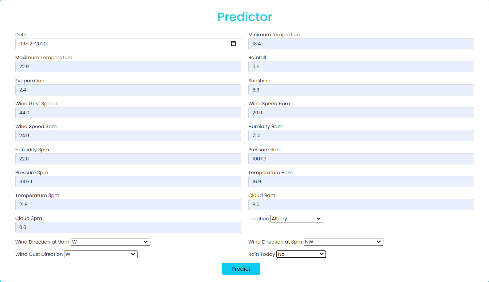

# Australian Rain Predictor

## Description
The "Australian Rain Predictor" is a machine learning project designed to forecast rainfall in Australia using historical weather data. This repository includes comprehensive scripts for data preprocessing, model training, evaluation, and deployment, making it an ideal resource for those interested in predictive analytics, weather forecasting, and data science applications.


## Environment Creation

Use Anaconda Prompt to create the environment

```
conda create -p venv python==3.8 -y
```
Activate the Environment 
```
activate venv/
```
## Installation

Use this simple command to run the library installations

```
pip install -r requirements.txt
```
## Run Command
```
python app.py
```
## Project Structure




## Fields used in the project
Here is a list of fields used in the dataset:

. Date: The date of the observation.

. Location: The location of the weather station.

. MinTemp: Minimum temperature for the day.

. MaxTemp: Maximum temperature for the day.

. Rainfall: Amount of rainfall recorded for the day.

. Evaporation: The amount of evaporation (mm) for the day.

. Sunshine: The number of hours of bright sunshine in the day.

. WindGustDir: Direction of the strongest wind gust.

. WindGustSpeed: Speed of the strongest wind gust.

. WindDir9am: Wind direction at 9am.

. WindDir3pm: Wind direction at 3pm.

. WindSpeed9am: Wind speed at 9am.

. WindSpeed3pm: Wind speed at 3pm.

. Humidity9am: Humidity at 9am.

. Humidity3pm: Humidity at 3pm.

. Pressure9am: Atmospheric pressure at 9am.

. Pressure3pm: Atmospheric pressure at 3pm.

. Cloud9am: Cloud cover at 9am.

. Cloud3pm: Cloud cover at 3pm.

. Temp9am: Temperature at 9am.

. Temp3pm: Temperature at 3pm.

. RainToday: Whether it rained today (Yes/No).

. RainTomorrow: The target variable indicating whether it will    rain tomorrow (Yes/No).
## Heroku Link

https://flight-price-predictor-f8bcaf1fecc5.herokuapp.com/
## License

[MIT](https://choosealicense.com/licenses/mit/)


## Acknowledgements

Special thanks to Krish naik.
